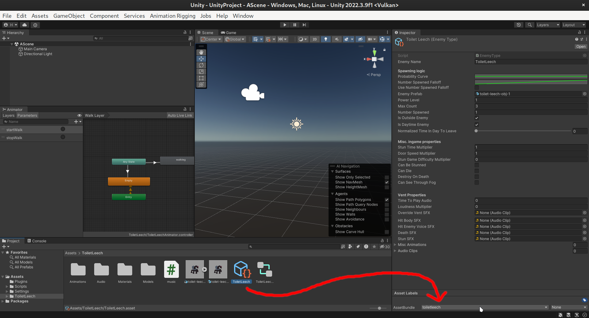
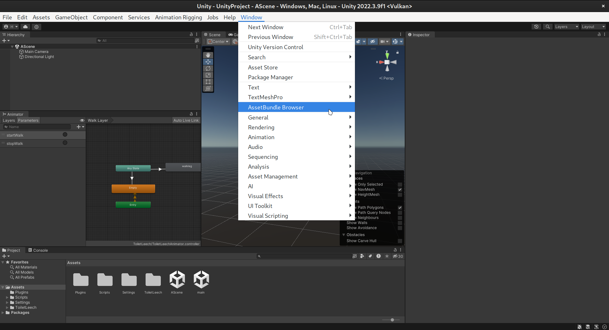
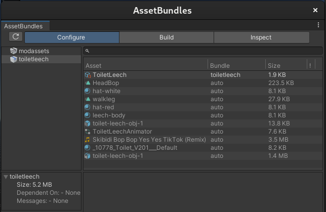
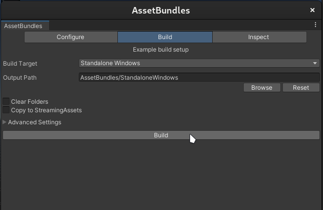

# About Assets

The goal of this resource and project is to be a reference implementation and documentation on custom enemies.
While this is still very much WIP, it might be useful to someone.

### Note:

Check [README](/README.md) for a somewhat accurate state of this resource!

The contents in this directory are not directly used during the building process, and are exluded in the csproj file.  
The unity project constains everything that gets turned into an asset bundle named "toiletleech", with the accompanying file "toiletleech.manifest".

All of the software used in this process are available on both Windows and Linux. However, on Linux, it is possible that Unity 2022.3.9f might output sounds into the wrong place, which is a bug in Unity. I don't know a solution for this, but if you don't hear anything in the Unity editor, this might be the issue. The sounds should still work when the asset bundle is exported and the game is launched with the mod.

## Blender

> https://www.blender.org/about/  
Blender is the free and open source 3D creation suite. It supports the entirety of the 3D pipeline—modeling, rigging, animation, simulation, rendering, compositing and motion tracking, even video editing and game creation.

Blender is an amazing program and it can do everything you want when making your 3D model. Files that end with .blend or .blend1 (a backup) are blender projects. While you work with these files, you need to export your model as fbx when importing it to Unity. However, in order to model, rig and animate your models, you need to learn blender first.  
You can install Blender from https://www.blender.org/download/, or if you are on Linux, I recommend installing the [Flatpak](https://flathub.org/apps/org.blender.Blender) package.

Here are some resources to get started with Blender:

### Basics

**Pro Tip!** Don't press random keys, as Blender has a lot of keyboard shortcuts and you might have no idea what you just did or how to undo it. That said, keyboard shortcuts can speed up your workflow by a lot, and you can use this [Blender Shortcuts Cheat Sheet](https://docs.google.com/document/d/1zPBgZAdftWa6WVa7UIFUqW_7EcqOYE0X743RqFuJL3o/edit?pli=1#heading=h.ftqi9ub1gec3) by Blender Guru, which can be useful.

If you have absolutely no experience about Blender, the 4 first parts of this series will be relevant.  
[Blender 4.0 Beginner Donut Tutorial](https://www.youtube.com/playlist?list=PLjEaoINr3zgEPv5y--4MKpciLaoQYZB1Z) (playlist) - Blender Guru
- [Part 1: Introduction](https://youtu.be/B0J27sf9N1Y?list=PLjEaoINr3zgEPv5y--4MKpciLaoQYZB1Z) - Introduces Blender and very basic things
- [Part 2: Basic Modelling](https://youtu.be/tBpnKTAc5Eo?list=PLjEaoINr3zgEPv5y--4MKpciLaoQYZB1Z) - Self-explanatory
- [Part 3: Modelling the Icing](https://youtu.be/AqJx5TJyhes?list=PLjEaoINr3zgEPv5y--4MKpciLaoQYZB1Z&t=42) - introduces more advanced modeling techniques
- [Part 4: Sculpting](https://youtu.be/--GVNZnSROc?list=PLjEaoINr3zgEPv5y--4MKpciLaoQYZB1Z) - Sculpting can be especially useful when modeling organic things

### Modeling

- [Fast Character Modeling with the Skin Modifier in Blender](https://youtu.be/DAAwy_l4jw4) - Joey Carlino
    - Introduces a super cool and easy modeling technique. I recommend this a lot for making basic initial meshes for characters.

// TODO: add more resources

### Modeling - Common issues

**My mesh looks inverted in Blender or when imported to Unity.**  
This is because your normals are inverted in a way or another. Select your mesh in Edit Mode, press A to select everything, press Shift+N to recalculate normals (do not select "Inside", it is the flipped state).  
If this doesn't fix it when importing to Unity, you likely have resized your object by a negative amount. This looks normal in Blender, but not in Unity. To fix this, go into Object Mode, select your object, press Ctrl+A, select apply scale. Now your normals should have flipped in Blender. Now, recalculate normals.

// TODO: add more stuff

### Materials & Texturing, UV Unwrapping

**Note:** Unity does not understand Blender's shader node system. If you use it for other than the princibled BSDF, you need to bake your material as a texture for it to work in Unity. Do also note that Lethal Company adds its style to everything, so you don't need to worry about that. However, textures are not necessary so you can basically skip this section entirely.

// TODO: add resources

### Rigging

- [Tutorial: My New Rigging Workflow in Blender](https://youtu.be/BiPoPMnU2VI) - Polyfjord
    - Inverse kinematics on a mechanical character. Very useful for rigging legs.
- [Rigging for impatient people - Blender Tutorial](https://youtu.be/DDeB4tDVCGY) - Joey Carlino
    - A lot of useful stuff about rigging. Very fast paced, so maybe better to watch after a more introductory tutorial.
- [How to Rig and Animate in BLENDER!](https://youtu.be/1khSuB6sER0) - ProductionCrate
    - Making a rig for a humanoid character, fixing issues with Blender's automatic weights feature, inverse kinematics. 

// TODO: add more resources

### Animation & NLA (Nonlinear Animation) Editor

**Note:** We put our individual animations in the NLA Editor so we can use them separately in Unity. The length of the animation in Unity will be the length that you set in the NLA editor. This is important to know if you set an animation cycle to repeat a certain amount of times in Blender when you want to for example preview it in combination with your other animations.

- [The Nuts and Bolts of Blender's animation system](https://youtu.be/p3m57yAcsi0) - CGDive
    - Introduces concepts in a very in-depth way. Introduces Timeline, Dope Sheet, Graph Editor, NLA Editor, Actions.
- [Un-confusing the NLA Editor (Nonlinear Animation)](https://youtu.be/tAo7HxxxA08) - GCDive
    - A more in-depth video about the NLA Editor. Do note though, we do not need to do anything complex with the NLA Editor.
- [Become a PRO at Animation in 25 Minutes | Blender Tutorial](https://youtu.be/_C2ClFO3FAY) - CG Geek
    - Animating a walk cycle. Uses Timeline, Dope Sheet and Graph Editor. Uses references for animation.
- [Character animation for impatient people - Blender Tutorial](https://youtu.be/GAIZkIfXXjQ) - Joey Carlino
    - If you don't want to make and rig your own models.

// TODO: add more resources

### Exporting assets for Unity

Export the model as fbx
// TODO: write the rest

## Unity

Important! Lethal Company uses Unity version 2022.3.9f, and therefore we use it too in order to avoid any issues with version differences when exporting our asset bundles.  
You can download Unity Hub (which is where you install 2022.3.9f) from https://unity.com/download, or if you are on Linux, you should probably use the unofficial [Flatpak](https://flathub.org/apps/com.unity.UnityHub) package, or follow [these install instructions](https://docs.unity3d.com/hub/manual/InstallHub.html#install-hub-linux) if you truly despise Flatpak.

You can open the Unity project by choosing to open a project from disk, and selecting the UnityProject folder. When Unity has loaded the project, look into the ToiletLeech folder for the assets that make up the asset bundle.

### Setting up the Unity project

The Unity project we have is based off of Evaisa's [Lethal Company Unity Template](https://github.com/EvaisaDev/LethalCompanyUnityTemplate/) (hence the LICENSE file in that folder. I have no idea if I can remove it or not). HOWEVER, just like with our dlls in the root directory of this repository, we need to add some dll files into our `UnityProject/Assets/Plugins` folder. These are listed in the README of Evaisa's repository, but here's the list so you don't miss it:
>- AmazingAssets.TerrainToMesh.dll
>- ClientNetworkTransform.dll
>- DissonanceVoip.dll
>- Facepunch Transport for Netcode for GameObjects.dll
>- Facepunch.Steamworks.Win64.dll
>- Newtonsoft.Json.dll
>- Assembly-CSharp-firstpass.dll

This part needs confirmation, as I have not tested the project without these dll files and I don't know anything about this stuff.
Anyways, you might also need to add these files from `Lethal Company/BepInEx/core`:
>- 0Harmony20.dll
>- 0Harmony.dll
>- BepInEx.dll
>- BepInEx.Preloader.dll
>- HarmonyXInterop.dll
>- Mono.Cecil.dll
>- Mono.Cecil.Mdb.dll
>- Mono.Cecil.Pdb.dll
>- Mono.Cecil.Rocks.dll
>- MonoMod.RuntimeDetour.dll
>- MonoMod.Utils.dll

Also, you might want to add `BepInEx.Harmony.dll` too from the same location, but for me it causes Unity to crash so I don't have it. Idk if this is for everyone, but we don't seem to need that file anyways for making the asset bundle.

We also depend on LethalLib by Evaisa (which is already included in the project), and it depends on MMHOOK, so I think you need to run the game once with MMHOOK add their dlls too I guess. (actually I have no idea about any of this and I'm probably wrong considering we already have non-MMHOOK dlls included, so please try building the asset bundle without these, and if the mod works with that asset bundle, message me. I don't feel like wasting time on this right now):
>- MMHOOK_AmazingAssets.TerrainToMesh.dll
>- MMHOOK_Assembly-CSharp.dll
>- MMHOOK_ClientNetworkTransform.dll
>- MMHOOK_DissonanceVoip.dll
>- MMHOOK_Facepunch.Steamworks.Win64.dll
>- MMHOOK_Facepunch Transport for Netcode for GameObjects.dll

The dll file of this mod also needs to be there so we can reference ToiletLeechAI from a component of the Toilet Leech prefab in Unity. It needs to be from the dll file, you cannot just copy and paste the ToiletLeechAI.cs file in the Unity project because asset bundles cannot contain scripts, and it just doesn't get the reference otherwise. You know it doesn't get the reference in the form of a yellow warning text if you launch the game with the mod and you have unity logging enabled in the `BepInEx.cfg` file.

### What are asset bundles?

> https://docs.unity3d.com/Manual/AssetBundlesIntro.html  
An AssetBundle is an archive file that contains platform-specific non-code Assets (such as Models, Textures, Prefabs, Audio clips, and even entire Scenes) that Unity can load at run time. AssetBundles can express dependencies between each other; for example, a Material in one AssetBundle can reference a Texture in another AssetBundle. For efficient delivery over networks, you can compress AssetBundles with a choice of built-in algorithms depending on use case requirements (LZMA and LZ4).
>
> AssetBundles can be useful for downloadable content (DLC), reducing initial install size, loading assets optimized for the end-user’s platform, and reduce runtime memory pressure.
>
> Note: An AssetBundle can contain the serialized data of an instance of a code object, such as a ScriptableObject. However, the class definition itself is compiled into one of the Project assemblies. When you load a serialized object in an AssetBundle, Unity finds the matching class definition, creates an instance of it, and sets that instance’s fields using the serialized values. This means that you can introduce new items to your game in an AssetBundle as long as those items do not require any changes to your class definitions.

Asset bundles are a way for us to basically transfer our enemy from our Unity project to Lethal Company.

### Our Toilet Leech assets in Unity

// TODO: write the rest

### Adding things to an asset bundle

To add a thing to an asset bundle, you first need to select the object you want to add, and then on the asset bundle dropdown, select "New..." and write the name of your asset bundle. Or if you already have an asset bundle, you can just select that. You don't actually need to assign everything you need to the asset bundle as long as the thing you assigned to the asset bundle depends on the rest of the things, which in our case is true.  

### How to build an asset bundle:

1. Open asset bundle browser (this plugin is included in the Lethal Company Unity Template):  

2. Here we can see files that are included in our bundle. The ones that have the bundle as "auto" are things that our thing we have assigned to the asset bundle depends on, so they will be included as well. I don't know what modassets really is, it came with the Lethal Company Unity Template too. Should probably ask Evaisa, but anyways we can ignore it.  

3. This is where we build our asset bundle. The asset bundle will be found where output path specifies, which in this case exists in a directory in the root of the Unity project.  

4. Then we copy both `toiletleech` and `toiletleech.manifest` to the root of this repository. (Actually, we could probably just reference them without copy pasting them as they exist in this repository already. If you try this and it works, and you might have to edit the csproj file for that, please open an issue or a pull request. I don't have time to do that right now.)

Note: if you don't have Windows standalone build support installed in your Unity installation, close unity and install it from Unity Hub. I'm not 100% sure if this is actually needed, but I had no luck getting the materials of the model working in the asset bundle when I had my build target set to Linux, which I didn't realize could affect anything.

// TODO: write the rest