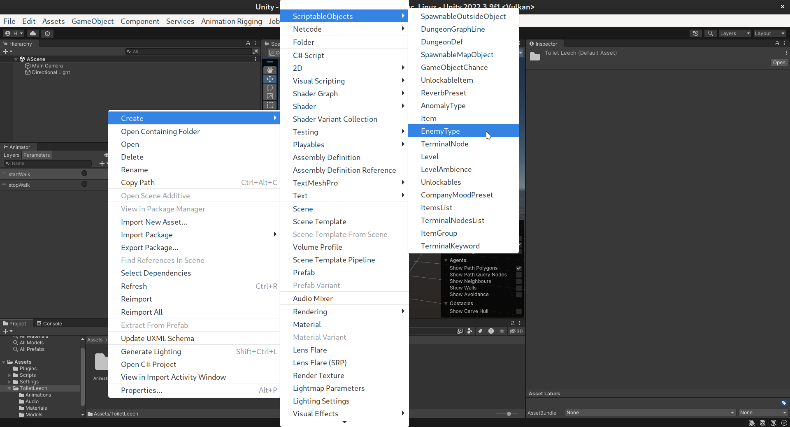

# Opening our Unity Project

You can open the Unity project included in this repository by choosing to open a project from disk, and selecting the `UnityProject` folder. When Unity has loaded the project, look into the ToiletLeech folder for the assets that make up the asset bundle.

### Setting Up The Unity Project

> [!NOTE]  
> The [SETUP-PROJECT.py](/SETUP-PROJECT.py) script will copy all of the dlls files for you! So if you run it, you can ignore this section almost entirely.

The Unity project we have is based off of Evaisa's [Lethal Company Unity Template](https://github.com/EvaisaDev/LethalCompanyUnityTemplate/) (hence the LICENSE file in that folder. I have no idea if I can remove it or not). HOWEVER, just like with our dlls in the root directory of this repository, we need to add some dll files into our `UnityProject/Assets/Plugins` folder. These are listed in the README of Evaisa's repository, but here's the list so you don't miss it:
>- AmazingAssets.TerrainToMesh.dll
>- ClientNetworkTransform.dll
>- DissonanceVoip.dll
>- Facepunch Transport for Netcode for GameObjects.dll
>- Facepunch.Steamworks.Win64.dll
>- Newtonsoft.Json.dll
>- Assembly-CSharp-firstpass.dll

This part needs confirmation, as I have not tested the project without these dll files and I don't know anything about this stuff.
Anyways, you might also need to add these files from `Lethal Company/BepInEx/core`:
>- 0Harmony20.dll
>- 0Harmony.dll
>- BepInEx.dll
>- BepInEx.Preloader.dll
>- HarmonyXInterop.dll
>- Mono.Cecil.dll
>- Mono.Cecil.Mdb.dll
>- Mono.Cecil.Pdb.dll
>- Mono.Cecil.Rocks.dll
>- MonoMod.RuntimeDetour.dll
>- MonoMod.Utils.dll

Also, you would probably normally want to add `BepInEx.Harmony.dll` too from the same location, but it causes Unity to crash when building asset bundles, so we don't add it. But we don't seem to need that file anyways for making our asset bundle. If you know why this is, please tell about it!

We also depend on LethalLib by Evaisa (which is already included in the project), and it depends on MMHOOK, so you need to run the game once with MMHOOK so these dll files are generated:
>- MMHOOK_AmazingAssets.TerrainToMesh.dll
>- MMHOOK_Assembly-CSharp.dll
>- MMHOOK_ClientNetworkTransform.dll
>- MMHOOK_DissonanceVoip.dll
>- MMHOOK_Facepunch.Steamworks.Win64.dll
>- MMHOOK_Facepunch Transport for Netcode for GameObjects.dll

The dll file of this mod also needs to be there so we can reference ToiletLeechAI from a component of the Toilet Leech prefab in Unity. It needs to be from the dll file, you cannot just copy and paste the ToiletLeechAI.cs file in the Unity project because asset bundles cannot contain scripts, and it just doesn't get the reference otherwise. You know it doesn't get the reference in the form of a yellow warning text if you launch the game with the mod and you have unity logging enabled in the `BepInEx.cfg` file.

### What Are Asset Bundles?

> https://docs.unity3d.com/Manual/AssetBundlesIntro.html  
An AssetBundle is an archive file that contains platform-specific non-code Assets (such as Models, Textures, Prefabs, Audio clips, and even entire Scenes) that Unity can load at run time. AssetBundles can express dependencies between each other; for example, a Material in one AssetBundle can reference a Texture in another AssetBundle. For efficient delivery over networks, you can compress AssetBundles with a choice of built-in algorithms depending on use case requirements (LZMA and LZ4).
>
> AssetBundles can be useful for downloadable content (DLC), reducing initial install size, loading assets optimized for the end-user’s platform, and reduce runtime memory pressure.
>
> Note: An AssetBundle can contain the serialized data of an instance of a code object, such as a ScriptableObject. However, the class definition itself is compiled into one of the Project assemblies. When you load a serialized object in an AssetBundle, Unity finds the matching class definition, creates an instance of it, and sets that instance’s fields using the serialized values. This means that you can introduce new items to your game in an AssetBundle as long as those items do not require any changes to your class definitions.

Asset bundles are a way for us to basically transfer our enemy from our Unity project to Lethal Company.

### Our Toilet Leech Assets In Unity

We have made a ToiletLeech folder in our Unity project. Everything that goes into our asset bundle is in there.
The first thing we did was import our fbx model into Unity. It contains all the materials, textures and animations of our model when first imported, but it is good to separate some of that stuff into their own folders. We have extracted our materials into the `Materials` folder.

We have also copied the individual animations into the `Animations` folder, because I don't know how to separate them properly, but we can just ignore the animations embedded in the fbx file and use the copies inside the `Animations` folder anyways.

And at this point of writing this, I realised we have two, probably identical versions of the fbx model in the project, one in the `Models` folder, and one directly in `ToiletLeech`, which is basically our root folder. We are meant to only have the one in `Models` and use that, **but I will fix that later. Also note to self: remove the music.cs file too. It does nothing.** At least, it shouldn't.

Anyways, how do we make the game see our assets as an enemy? Well, we create a new Scriptable Object of type EnemyType. This is what the game uses, so we need it too. Do note that these Scriptable Objects come from the Lethal Company Unity Template this is based off of. Do also note that our UnityProject in this repository is already configured properly *(for other than the missing stuff, like right click showing enemy name and enemy info page getting added to terminal. It will be added when I have time to do so)*.  

The EnemyType Scriptable Object has some configuration options, and the most important thing is the "Enemy Prefab" part of it. This is where we tell it what the model and whatever stuff our EnemyType has. Also note the "Enemy Name" thingy, this will be the name of the ToiletLeech enemy in the coding side of things.

// TODO: write the rest

### Adding Things To An Asset Bundle

To add a thing to an asset bundle, you first need to select the object you want to add, and then on the asset bundle dropdown, select "New..." and write the name of your asset bundle. Or if you already have an asset bundle, you can just select that. You don't actually need to assign everything you need to the asset bundle as long as the thing you assigned to the asset bundle depends on the rest of the things, which in our case is true.  

### How To Build An Asset Bundle:

1. Open asset bundle browser (this plugin is included in the Lethal Company Unity Template):  

2. Here we can see files that are included in our bundle. The ones that have the bundle as "auto" are things that our thing we have assigned to the asset bundle depends on, so they will be included as well. I don't know what modassets really is, it came with the Lethal Company Unity Template too. Should probably ask Evaisa, but anyways we can ignore it.  

3. This is where we build our asset bundle. The asset bundle will be found where output path specifies, which in this case exists in a directory in the root of the Unity project.  

4. Then we copy both `toiletleech` and `toiletleech.manifest` to the root of this repository. (Actually, we could probably just reference them without copy pasting them as they exist in this repository already. If you try this and it works, and you might have to edit the csproj file for that, please open an issue or a pull request. I don't have time to do that right now.)

> [!NOTE]  
> If you don't have Windows standalone build support installed in your Unity installation, close unity and install it from Unity Hub. I'm not 100% sure if this is actually needed, but I had no luck getting the materials of the model working in the asset bundle when I had my build target set to Linux, which I didn't realize could affect anything.

// TODO: write the rest